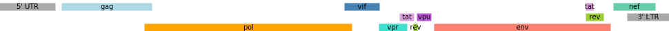

# genetracks
Generate track diagrams for genomic alignments

see [examples/Genetracks.ipynb](examples/Genetracks.ipynb) for use cases

### Example

```python
figure = Figure(height=90, size=500)
figure.add_track(Multitrack([
        Track(0, 150, direction='f', label='Forward read'),
        Track(200, 350, direction='r', label='Reverse read')], join=True))
figure.add_track(Track(50, 250, direction='fr', label='Read-through', color='salmon', regions=[(75, 225, 'lightgrey')]))
figure.add_track(Track(50, 300, label='Reads overlap'))
figure.show()
```


